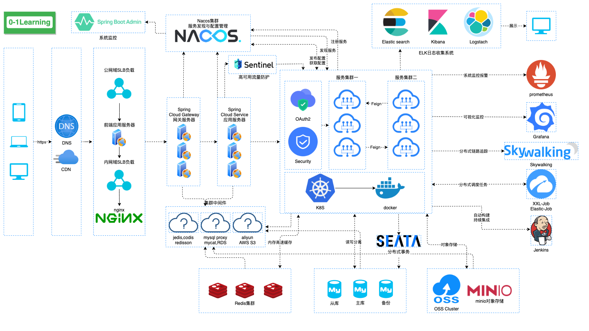

# timber-web

## 项目介绍（Project Introduction）

项目取名timber——`木材`，寓意人类从刀耕火种逐渐进化的源头，星星之火，可以燎原，愿这个项目也可以成为开发者入门的源头。

这是一个实现`0-1Learning`这个项目所有的知识点的实现项目，包括的Java backend(后端)，web frontend(前端)，Android App，ios App、小程序等一整套的项目合集，可以让你一次性接触到任何一端的项目开发流程是怎么样的（yes,so cool）

你可以选择从`0-1`实现任何一端开始学习项目开发，也可以先写好后端服务及接口、再写前端、和App等项目。

任何一端的项目都可以拷贝到本地直接运行，构建你自己的本地服务。

如果想搞懂更多的项目知识体系，更多项目所有技术文档都在 [0-1Learning](http://github.com/soonphe/0-1Learning) 中有完整介绍，欢迎前往阅读。

### 设备支持（Equipment Support）

设备支持：`java`,`web`、`android`、`ios`、`小程序`

### 项目地址（Project Address）
- java backend：[timber-web](http://github.com/soonphe/timber)
- web frontend：[timber-web](http://github.com/soonphe/timber-web)
- android APP：[timber-android](http://github.com/soonphe/timber-android)
- ios App：[timber-ios](http://github.com/soonphe/timber-ios)
- 小程序：[timber-applets](http://github.com/soonphe/timber-applets)

### 业务支持（Business Support）

- 广告业务：支持广告智能投放，自动上架与下架，广告覆盖有效统计
- 电影业务：对接xx电影网
- 视频业务：小视频点播
- 音乐业务：音乐播放、下载
- 小说业务：文件上传和爬虫抓取
- 新闻业务：定期抓取
- 游戏业务：html游戏
- 城市特色业务：城市介绍，衣食住行、景点、广告引流

### 业务功能模块（Functional Module）

```
├── 系统模块
    ├── 用户统一管理后台系统UUM
    └── 权限系统模块
├── 业务模块
    ├── 广告模块
    ├── 电影模块
    ├── 视频模块
    ├── 音乐模块
    ├── 小说模块
    ├── 新闻模块
    ├── 游戏模块
    └── 城市模块
├── 搜索模块
├── 三方功能模块
└── 数据模块
    ├── 埋点模块
    └── 统计模块
```

### 高可用分布式系统架构（Highly available distributed system architecture）



### 系统技术栈（System Technology Stack）


### 项目结构（Project Structure）

```
timber-web
├── build: 编译支持
├── mock: mock API模块
    ├── ...js：mock请求API
    ├── index.js：mock API聚合
├── public: 静态渲染html入口
    ├── index.html：主页面
    ├── favicon.ico：图标
    └── ...：其他静态
├── src:
    ├── api：真实请求API模块 *
        ├── api：请求接口封装
        └── server.js：请求接口列表
    ├── assets：静态文件模块
    ├── components：自定义控件组件 *（大部分组件都在这里编写、复用，如：面包屑，github，左部菜单控件，全屏控件，错误日志。。。）
    ├── directive：自定义指令模块
    ├── filters：过滤器模块
    ├── icons：图标模块(主要支持svg)
    ├── lang：国际化模块
    ├── layout：界面基础布局模块(上navbar，左sidebar，右app-main)
    ├── router：路由模块 *
    ├── store：vuex模块 *
    ├── styles：css模块
    ├── utils：通用工具模块
    ├── vendor：excel操作模块
    ├── views：业务界面模块，主要界面都在这里编写 *
        ├── views1：业务界面1
        ├── views2：业务界面2
        └── views...：业务界面...
    ├── App.vue：主程序入口
    ├── main.js：程序入口
    ├── permission.js：权限模块
    └── settings：系统设置模块
├── .env...: 环境变量
├── packgae.json: npm依赖配置
├── vue.config.js: 项目配置
└── README.md -- 说明

备注：标 * 的为重点模块
```

### 项目架构（System Architecture）

#### 1.基础项目架构（Base Framework）
+ 技术选型：vue
+ 路由管理：router
+ 网络请求：axios
+ 状态管理：vuex
+ 国际化：vue-i18n
+ 代码检查：eslint
+ UI框架：element-ui

#### 2.控件库（Widget Library）
+ CSS：
  + less：客户端渲染
  + sass：服务端渲染，缺点就是容易npm安装失败，头疼
+ 图表：
  + echarts：
+ 富文本：
  + vue-editor2：这个对图片上传的支持度不错，界面也比较友好
  + vue-quill-editor：老牌，稳定
+ 图标：
  + font-awesome(推荐，主要是方便，直接引库就行，缺点数量有限，不过也够用了)
  + svg（麻烦一点，需要自己找图作图，好处是矢量图标不失真）
+ 换肤：chalk

#### 3.工具库（Tools Library）
+ cookie管理：js-cookie
+ 加密工具：js-md5


### 工作进度（Work Progress）
- 相关版本：Node -v：v16.9.1      Npm -v：7.21.1
- vue升级3.0，Element-ui升级element-plus（全面支持vue3.0）（暂缓）
- mock数据（mock-server去除，使用index.js，mock系统中台、左侧菜单）(已完成)
- 登录
- 界面(保存用户信息，token，menu，userInfo)(已完成)
- 顶部菜单（展示用户名，退出-清除用户相关信息）（已完成）
- 左侧菜单
  - 多层菜单嵌套处理（原先只支持两级，目前可无限嵌套，后端支持无限嵌套，前端也支持）✔️
  - 静态化（使用静态json返回，或者使用mock返回——mock优先级最高）✔️
  - 左侧菜单-头部logo✔️
  - icon图标修复（font-awesomed✔️、svg图标✔️），
    - font-awesomed组件参考：https://fontawesome.dashgame.com/

      ```
      <!-- vue模块图标，三种图标方案 -->
      //element内置图标，样式较少
      <i class="el-icon-info"></i>
      ```
  //svg矢量图片，需要自己找

  <svg-icon class-name="search-icon" icon-class="search"/>

  //font-awesome图标，需要引入库
  <i class="sidebar-icon fa fa-tachometer"></i>
  ```

- 网络请求封装✔️

  - api请求封装✔️
  - api路径整理✔️

- router封装✔️

- store调整

- 系统管理界面✔️

- 添加修改功能合并✔️

  - 使用弹窗✔️
  - 界面不跳转，改推拉式

- 文件上传文件模块✔️

  - nginx配置图片服务器（http://localhost:80/）
  - 使用minio代替图片上传✔️

- conponents组件集成更新（可暂缓）

- 界面调整，删除无用界面，router，api（已完成）

- 业务增删查改（已完成）

- 文章富文本（已使用vue2-editor完成）✔️

  - https://github.com/surmon-china/vue-quill-editor
  - https://github.com/davidroyer/vue2-editor

- 分类管理（表格懒加载）（已完成）

- 变量格式问题：list: null是错误的，正确的定义 数组 list: []，对象 time: undefined，数组添加this.groupIdAttr.push(item.groupId)

- 配置管理，获取业务线枚举（已完成）

- 菜单栏分页，点击加载子菜单（已完成）

- 广告栏类型分类获取（已完成）

- 合并ywzt-tools，mock重新编写（已完成）

- 城市文章调整（已去除）

- 统计模块使用mock编写（已完成）

- excel导出（已完成）

- 统计管理（使用mock，删除table）（已完成）

## 公众号

`0-1Learning`项目全套学习教程连载中，关注公众号「**罗晓胜**」第一时间获取。

加微信群交流，公众号后台回复「**加群**」即可。


